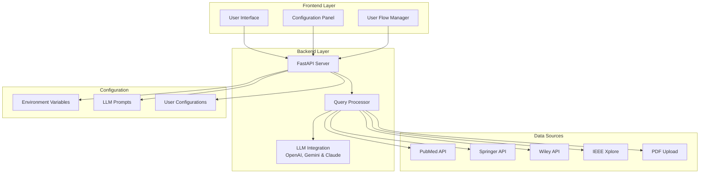
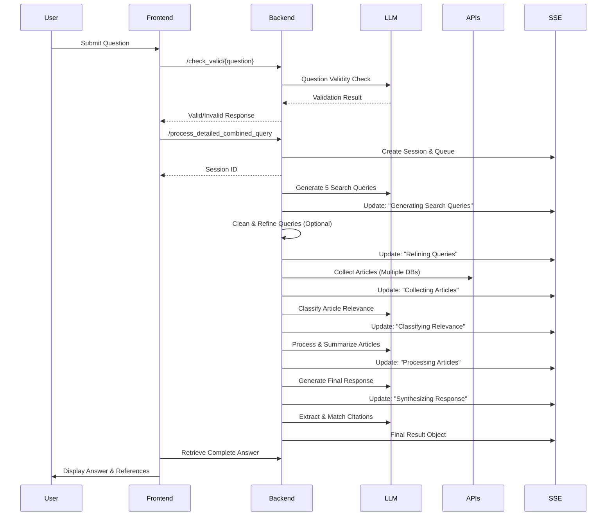
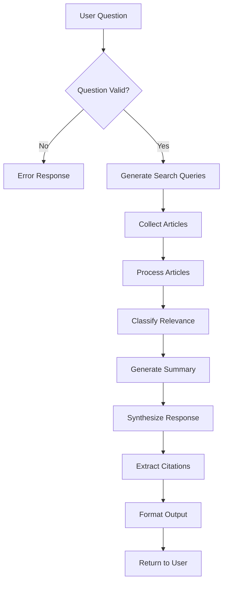

# Custom-Nerd/Nerd-Engine: Complete Technical Documentation & Workflow Analysis

## Table of Contents
1. [Project Overview](#project-overview)
2. [Architecture Overview](#architecture-overview)
3. [Complete Project Structure](#complete-project-structure)
4. [Component Analysis](#component-analysis)
5. [Processing Workflow](#processing-workflow)
6. [Configuration System](#configuration-system)
7. [API Integration Details](#api-integration-details)
8. [Data Flow Architecture](#data-flow-architecture)
9. [Frontend-Backend Communication](#frontend-backend-communication)
10. [Deployment & Environment Management](#deployment--environment-management)

---

## Project Overview

Custom-Nerd/Nerd-Engine is a sophisticated web-based LLM-powered research assistant that provides evidence-based answers to domain-specific questions by extracting and synthesizing information from multiple academic databases. The system employs a modular architecture with configurable search strategies, real-time processing updates, and comprehensive safety mechanisms.

### Core Capabilities
- **Multi-Database Academic Search**: PubMed, IEEE Xplore, Springer, Wiley, Oxford Academic, Stack Overflow
- **Domain-Specific Configuration**: Customizable for any research domain (Diet, News, Space, Science, Cloud, etc.)
- **Evidence-Based Response Generation**: LLM-powered synthesis with academic citations (OpenAI GPT, Google Gemini, or Anthropic Claude support)
- **Real-Time Processing Updates**: Server-Sent Events (SSE) for live progress tracking
- **PDF Document Processing**: Local file upload and analysis capabilities
- **Similarity Search**: Advanced question matching using TF-IDF, Jaccard, and fuzzy algorithms
- **Chat History Management**: Automatic conversation storage and retrieval with configurable visibility
- **Configurable UI/UX**: Dynamic theming and content customization

---

## Architecture Overview

Custom-Nerd/Nerd-Engine follows a **modular microservice-inspired architecture** with clear separation of concerns:



---

## Complete Project Structure

### Directory Hierarchy

```
customnerd/
├── customnerd-backend/          # Python FastAPI Backend
│   ├── main.py                  # FastAPI app entry point
│   ├── helper_functions.py      # Core processing functions
│   ├── openai_prompts.py       # LLM prompt templates
│   ├── user_search_apis.py     # Configurable search implementations
│   ├── user_list_search.py     # ID-based search implementations
│   ├── generic_prompts.py      # AI code generation prompts
│   ├── variables.env           # API keys and environment variables
│   ├── venv/                   # Python virtual environment
│   ├── saved_states/           # Configuration state management
│   │   ├── DietNerd/          # Diet-specific configurations
│   │   └── NewsNerd/          # News-specific configurations
│   └── hard_backup/           # System backup files
│
├── customnerd-website/         # Frontend Web Application
│   ├── index.html             # Main application page
│   ├── index.js               # Core frontend logic
│   ├── index.css              # Main styling
│   ├── config.html            # Configuration interface
│   ├── config.js              # Configuration management
│   ├── config.css             # Configuration styling
│   ├── user_env.js            # User-specific environment config
│   ├── user_flow.js           # Search strategy management
│   ├── user_based.js          # Dynamic UI configuration
│   ├── env.js                 # API endpoint configuration
│   ├── reference.html         # Reference display page
│   ├── reference.js           # Reference functionality
│   ├── about.html             # About page
│   ├── contact.html           # Contact form
│   └── assets/                # Static assets (logos, images)
│
├── setup.py           # Automated setup script
├── run.py            # Server startup script
├── README.md                 # User documentation
└── Documentation.pdf         # Additional documentation
```

---

## Component Analysis

### Backend Components

#### 1. **main.py** - FastAPI Application Core
- **Primary Function**: Central API server handling all HTTP requests
- **Key Endpoints**:
  - `/check_valid/{question}` - Question validation
  - `/process_detailed_combined_query` - Main query processing
  - `/sse` - Server-Sent Events for real-time updates
  - `/fetch_frontend_config` - Configuration retrieval
  - `/update_frontend_config` - Configuration updates
  - `/generate_code_endpoint` - AI code generation
  - `/generate_prompt_endpoint` - AI prompt optimization

#### 2. **helper_functions.py** - Core Processing Engine
- **Primary Function**: Contains all core business logic and processing functions
- **Key Functions**:
  - `determine_question_validity()` - LLM-powered question filtering
  - `query_generation()` - Generates 5 optimized search queries
  - `organize_database_articles()` - Article metadata extraction and normalization
  - `relevance_classifier()` - LLM-powered relevance assessment
  - `generate_final_response()` - Evidence synthesis and response generation
  - `process_pdf_article()` - Local document processing
  - `get_full_text_*()` - Academic database full-text retrieval

#### 3. **openai_prompts.py** - LLM Prompt Repository
- **Primary Function**: Centralized prompt management for all LLM interactions
- **Prompt Categories**:
  - Question validation prompts
  - Search query generation prompts
  - Relevance classification prompts
  - Article processing prompts
  - Final response synthesis prompts

#### 4. **user_search_apis.py** - Configurable Search Interface
- **Primary Function**: Modular search implementation for different academic databases
- **Default Implementation**: PubMed integration via Bio.Entrez
- **Extensibility**: AI-assisted code generation for custom APIs

#### 5. **user_list_search.py** - ID-Based Search Interface
- **Primary Function**: Direct article retrieval using specific identifiers (PMIDs)
- **Implementation**: Bio.Entrez integration for PubMed ID-based searches

### Frontend Components

#### 1. **index.html & index.js** - Main Application Interface
- **Primary Function**: User query interface and result display
- **Key Features**:
  - Dynamic search strategy selection
  - Real-time processing updates via SSE
  - PDF generation capabilities
  - Reference display management

#### 2. **config.html & config.js** - Configuration Management System
- **Primary Function**: Comprehensive system configuration interface
- **Configuration Domains**:
  - Frontend appearance and behavior
  - Backend LLM prompts
  - Environment variables and API keys
  - User flow and search strategies
  - State management and backup/restore

#### 3. **user_env.js** - Environment Configuration
- **Primary Function**: Stores user-specific configuration data
- **Configuration Scope**:
  - Site branding (name, logo, icons)
  - UI styling (colors, fonts)
  - Search strategies visibility and settings
  - API endpoint configuration

#### 4. **user_flow.js** - Search Strategy Manager
- **Primary Function**: Dynamic search strategy UI generation and management
- **Capabilities**:
  - Dynamic HTML generation for search options
  - File upload handling for PDF documents
  - Search strategy validation and data collection

#### 5. **user_based.js** - Dynamic UI Configuration
- **Primary Function**: Applies user configurations to the DOM dynamically
- **Features**:
  - Real-time UI theming
  - Dynamic content updates
  - Favicon and logo management

---

## Processing Workflow

### Complete Query Processing Pipeline

The Custom-Nerd/Nerd-Engine system follows a sophisticated 10-stage processing pipeline with optional query cleaning:



### Detailed Stage Analysis

#### **Stage 1: Question Validation**
- **Purpose**: Filter inappropriate questions (recipes, animal-related queries)
- **Implementation**: LLM-powered classification using `DETERMINE_QUESTION_VALIDITY_PROMPT`
- **Output**: "True", "False - Recipe", or "False - Animal"

#### **Stage 2: Query Generation**
- **Purpose**: Create optimized search queries for academic databases
- **Process**:
  1. Generate 1 general query using `GENERAL_QUERY_PROMPT`
  2. Generate 4 contention-based queries using `QUERY_CONTENTION_PROMPT`
- **Output**: 5 specialized search queries

#### **Stage 3: Query Cleaning (Optional)**
- **Purpose**: Advanced preprocessing and refinement of search queries
- **Implementation**: Uses `clean_query.py` with `clean_query(query)` function
- **Process**:
  1. Normalizes complex terminology
  2. Removes duplicates and formatting artifacts
  3. Standardizes query formats for different databases
- **Output**: Refined and cleaned search queries

#### **Stage 4: Article Collection**
- **Purpose**: Gather articles from multiple academic databases
- **Sources**: PubMed (primary), Springer, Wiley, IEEE, Oxford Academic
- **Method**: Parallel API calls with deduplication by PMID
- **Limits**: 10 articles per query, 50 total maximum

#### **Stage 5: Relevance Classification**
- **Purpose**: Filter articles based on relevance to user query
- **Implementation**: LLM-powered binary classification using `RELEVANCE_CLASSIFIER_PROMPT`
- **Process**: Concurrent processing for performance optimization

#### **Stage 6: Article Processing & Summarization**
- **Purpose**: Extract and summarize key information from relevant articles
- **Methods**:
  - Full-text retrieval when available (PMC, Elsevier, Springer, etc.)
  - Abstract-based processing for restricted access articles
  - Publication type classification (study vs. review)
- **Output**: Structured article summaries with metadata

#### **Stage 7: PDF Document Processing** (Optional)
- **Purpose**: Process user-uploaded PDF documents
- **Capabilities**:
  - Text extraction using PyMuPDF
  - Metadata extraction and citation generation
  - Content summarization and abstract generation

#### **Stage 8: Response Synthesis**
- **Purpose**: Generate comprehensive, evidence-based answers
- **Implementation**: LLM-powered synthesis using `FINAL_RESPONSE_PROMPT`
- **Features**:
  - Evidence hierarchization by study quality
  - Citation integration
  - Safety disclaimers

#### **Stage 9: Citation Extraction & Matching**
- **Purpose**: Extract and link citations to source articles
- **Process**:
  1. Parse citations from generated response
  2. Match citations to article metadata
  3. Generate reference links and summaries

#### **Stage 10: Result Formatting & Delivery**
- **Purpose**: Prepare final output for frontend consumption
- **Output Structure**:
  ```json
  {
    "end_output": "formatted_response_with_citations",
    "relevant_articles": [article_metadata_array],
    "citations_obj": {citation_to_article_mapping},
    "citations": [extracted_citation_list]
  }
  ```

---

## Configuration System

### Multi-Level Configuration Architecture

Custom-Nerd/Nerd-Engine employs a sophisticated 4-tier configuration system:

#### **1. Frontend Flow Configuration**
```javascript
FRONTEND_FLOW: {
  SITE_NAME: "Diet Nerd",
  SITE_LOGO: "assets/customnerd_logo.png",
  SITE_ICON: "🥗",
  SITE_TAGLINE: "Evidence-based nutrition guidance",
  DISCLAIMER: "Educational purposes only...",
  QUESTION_PLACEHOLDER: "Enter your question...",
  STYLES: {
    BACKGROUND_COLOR: "#EFF8FF",
    FONT_FAMILY: "'Roboto', sans-serif",
    SUBMIT_BUTTON_BG: "#007bff"
  },
  API_URL: "http://127.0.0.1:8000"
}
```

#### **2. User Flow Configuration**
```javascript
USER_FLOW: {
  searchStrategies: [
    {
      id: "upload-articles",
      label: "Include articles from your computer",
      tooltip: "Only accepts PDF file formats",
      type: "file-upload",
      visible: true,
      defaultChecked: false
    },
    {
      id: "insert-pmids", 
      label: "Search using PMIDs",
      tooltip: "Enter PMIDs separated by semicolons",
      type: "text-input",
      visible: true,
      defaultChecked: false
    },
    {
      id: "search-pubmed",
      label: "Search using PubMed Articles", 
      tooltip: "Automatically search PubMed",
      type: "checkbox",
      visible: true,
      defaultChecked: true
    }
  ],
  reference_section: {
    visible: true
  }
}
```

#### **3. Backend Prompt Configuration**
- Centralized management of 10+ LLM prompts
- AI-assisted prompt optimization
- Domain-specific prompt customization
- Version control and rollback capabilities

#### **4. Environment Configuration**
- API key management for 8+ services
- Custom API key addition
- Secure storage and validation
- Environment-specific settings

#### **5. Query Cleaning Configuration**
- **File**: `clean_query.py`
- **Function**: `clean_query(query)` - refines and normalizes search queries
- **Features**:
  - Advanced preprocessing for complex terminology
  - Query format standardization
  - Duplicate removal and deduplication
  - Domain-specific query refinement
- **AI Code Generation**: Automated function creation for new domains
- **State Management**: Integrated with save/load state functionality

#### Saved State Templates (Domain Presets)

Preconfigured domain presets are provided under `customnerd-backend/saved_states/` to accelerate setup:

- DietNerd: PubMed-focused nutrition research (prompts, UI config, PubMed search code, env)
- NewsNerd: News aggregation via GNews, NewsAPI, and The Guardian with deduplication
- Space Nerd: Space/astronomy via arXiv, NASA Images, optional NASA ADS; includes `clean_query.py` for query refinement
- SciNer: QASPER-based scientific question answering configuration
- CloudNerd: Stack Overflow-based cloud technology research with security focus

Each preset folder typically includes:
- `openai_prompts.py`, `user_env.js`, `user_search_apis.py`, `user_list_search.py`, `variables.env`, and `historical_answer.json`
- Optional domain extras (e.g., `clean_query.py` for Space Nerd)

How to load a preset:
1. Open the Configuration UI → Load and Save State → choose a preset → Load; or
2. Copy the files from `saved_states/<Preset>/` into the running environment (backend/frontend as appropriate) and restart the server.

Security reminder: `variables.env` in presets may contain placeholders. Replace with your own keys locally and avoid committing real secrets.

### Similarity Search and Chat History System

#### Similarity Search Implementation
The system includes an advanced similarity search feature that finds similar questions from chat history using multiple algorithms:

**Algorithm Components:**
- **TF-IDF Vectorization**: Converts questions to numerical vectors for semantic similarity
- **Cosine Similarity**: Measures angle between vectors for semantic closeness
- **Word-level Similarity**: Token-based comparison for exact matches
- **Character-level Similarity**: Character sequence matching for typos and variations
- **Jaccard Similarity**: Set intersection over union for token overlap
- **Fuzzy String Matching**: Uses difflib for approximate string matching

**API Endpoint**: `/similar_questions`
- Parameters: `query` (string), `threshold` (float, default 0.3), `limit` (int, default 3)
- Returns: Array of similar questions with similarity scores and full result data

#### Chat History Management
**Storage Format**: `historical_answer.json`
```json
[
  {
    "timestamp": "2025-09-15T16:37:14Z",
    "session_id": "44f4c663-a83a-476f-a79c-e5533bced7b0",
    "input_text": "What are pros and cons of vitamin b12",
    "result": {
      "end_output": "...",
      "citations_obj": [...]
    }
  }
]
```

**Features:**
- **Automatic Saving**: Questions and answers saved after each successful query
- **Configurable Visibility**: Controlled via `chat_history.visible` in frontend config
- **Session Tracking**: Unique session IDs for conversation grouping
- **Recent History**: `/history_recent` endpoint with configurable limits
- **Clear Functionality**: `/clear_chat_history` endpoint for data management
- **State Integration**: Included in saved state templates with proper handling

**Configuration Control:**
- Chat history saving is controlled by `USER_FLOW.chat_history.visible` setting
- When disabled, empty `historical_answer.json` is saved with state templates
- When enabled, existing history is preserved during state save/load operations

### State Management System

#### **Saved States Directory Structure**
```
saved_states/
├── DietNerd/
│   ├── customnerd_logo.png
│   ├── openai_prompts.py
│   ├── user_env.js
│   ├── user_list_search.py
│   ├── user_search_apis.py
│   └── variables.env
├── NewsNerd/
│   └── [same file structure]
└── Space Nerd/
    ├── clean_query.py
    ├── customnerd_logo.png
    ├── openai_prompts.py
    ├── user_env.js
    ├── user_list_search.py
    ├── user_search_apis.py
    └── variables.env
```

#### **State Operations**
- **Save State**: Captures complete system configuration
- **Load State**: Restores system to saved configuration
- **Hard Reset**: Returns to factory defaults
- **Backup/Restore**: Manual configuration management

---

## API Integration Details

### Academic & Domain-Specific Integrations

#### **1. PubMed Integration (DietNerd)**
- **Library**: Bio.Entrez (Biopython)
- **Capabilities**:
  - Article search by query terms
  - Full metadata retrieval
  - PMC full-text access when available
  - PMID-based direct access
- **Rate Limits**: 3 requests/second (with API key)

#### **2. Elsevier Integration**
- **API**: Elsevier Article Retrieval API
- **Capabilities**:
  - Full-text retrieval for open access articles
  - Metadata extraction
  - PII-based article access
- **Authentication**: API key required

#### **3. Springer Integration**
- **API**: Springer Nature Article API
- **Capabilities**:
  - Full-text access for open articles
  - Metadata retrieval
  - DOI-based access
- **Authentication**: API key required

#### **4. Wiley Integration**
- **API**: Wiley Text and Data Mining API
- **Capabilities**:
  - PDF full-text retrieval
  - DOI-based access
  - Metadata extraction
- **Authentication**: Client token required

#### **5. Oxford Academic Integration**
#### **6. News Integrations (NewsNerd)**
- **APIs**: GNews API, NewsAPI, The Guardian Open Platform
- **Capabilities**:
  - News search and aggregation
  - Deduplication by title
  - Timeliness prioritization (publishedAt)
- **Authentication**: API keys required for each provider

#### **7. Space/Astronomy Integrations (SpaceNerd)**
- **APIs**: arXiv API, NASA ADS (token-based)
- **Capabilities**:
  - Category-filtered astronomy searches (e.g., astro-ph.*)
  - Preprint metadata and links (arXiv)
  - Peer-reviewed metadata and citations (ADS)
- **Authentication**: arXiv (open), ADS token required
- **API**: Oxford Academic API
- **Capabilities**:
  - Article metadata retrieval
  - Limited full-text access
- **Authentication**: API key and app header required

### LLM Integration (OpenAI, Google Gemini & Anthropic Claude)

#### **Model Configuration**
- **OpenAI Models**: GPT-4-turbo (primary), GPT-3.5-turbo (fallback)
- **Google Gemini Models**: Gemini-2.5-flash (primary)
- **Anthropic Claude Models**: claude-sonnet-4-5 (primary)
- **LLM Selection**: Configurable via `LLM` environment variable (OpenAI, Gemini, or Claude)
- **Temperature Settings**: Vary by task (0.1-0.7)
- **Token Management**: Dynamic limiting based on content length
- **Error Handling**: Exponential backoff for rate limits

#### **LLM Provider Selection**
The system supports OpenAI, Google Gemini, and Anthropic Claude with automatic routing:

**Configuration Method:**
- Set `LLM="OpenAI"` in `variables.env` for OpenAI models
- Set `LLM="Gemini"` in `variables.env` for Google Gemini models
- Set `LLM="Claude"` in `variables.env` for Anthropic Claude models
- System automatically routes all LLM calls to the selected provider

**Implementation Architecture:**
- `openai_executions.py`: OpenAI-specific API implementations
- `gemini_executions.py`: Google Gemini-specific API implementations
- `claude_executions.py`: Anthropic Claude-specific API implementations
- `helper_functions.py`: Routes calls based on `LLM` environment variable
- Seamless switching between providers without code changes

#### **Prompt Categories**
1. **Question Validation**: Domain-appropriate question filtering
2. **Query Generation**: Academic search query optimization
3. **Relevance Classification**: Binary relevance assessment
4. **Article Processing**: Content extraction and summarization
5. **Response Synthesis**: Evidence-based answer generation

---

## Data Flow Architecture

### Request-Response Cycle



### Real-Time Communication (SSE)

#### **Server-Sent Events Implementation**
```python
@app.get("/sse")
async def sse(session_id: str):
    return EventSourceResponse(event_generator(session_id))

async def event_generator(session_id):
    queue = update_queues[session_id]
    while True:
        try:
            update = await asyncio.wait_for(queue.get(), timeout=1.0)
            yield {"data": json.dumps({"update": update})}
        except asyncio.TimeoutError:
            yield {"data": json.dumps({"heartbeat": True})}
```

#### **Update Categories**
- Progress notifications ("Generating queries...", "Collecting articles...")
- Article count updates ("Found 25 relevant articles")
- Processing status ("Synthesizing response...")
- Final result delivery (complete answer object)

---

## Frontend-Backend Communication

### API Endpoint Mapping

#### **Core Endpoints**
| Endpoint | Method | Purpose | Parameters |
|----------|--------|---------|------------|
| `/check_valid/{question}` | GET | Question validation | question: string |
| `/process_detailed_combined_query` | POST | Main processing | FormData with query, files, options |
| `/sse` | GET | Real-time updates | session_id: string |
| `/fetch_frontend_config` | GET | Get UI config | None |
| `/update_frontend_config` | POST | Update UI config | FormData with config, logo |
| `/fetch_prompts_config` | GET | Get LLM prompts | None |
| `/update_prompts_config` | POST | Update prompts | JSON with prompt data |
| `/fetch_env_config` | GET | Get environment vars | None |
| `/update_env_config` | POST | Update API keys | JSON with key-value pairs |

#### **Configuration Endpoints**
| Endpoint | Method | Purpose | Parameters |
|----------|--------|---------|------------|
| `/fetch_backend_config` | GET | Get backend files | None |
| `/update_backend_config` | POST | Update search code | FormData with code files |
| `/generate_code_endpoint` | POST | AI code generation | JSON with content, type |
| `/generate_prompt_endpoint` | POST | AI prompt optimization | JSON with content, prompt_type |
| `/fetch_clean_query` | GET | Get clean_query.py content | None |
| `/save_clean_query` | POST | Save clean_query.py content | FormData with content |
| `/save_state` | POST | Save configuration | FormData with state_name |
| `/load_state` | POST | Load configuration | FormData with state_name |

### Data Transmission Formats

#### **Query Submission Format**
```javascript
const formData = new FormData();
formData.append('user_query', userQuery);
formData.append('search_pubmed', searchPubmed);
formData.append('search_pmid', insertPMIDs);
formData.append('search_pdf', uploadArticles);
formData.append('pmids', JSON.stringify(cleanedPmids));
pdfFiles.forEach((file) => formData.append('files', file));
```

#### **Response Format**
```json
{
  "end_output": "Formatted response with citations...",
  "relevant_articles": [
    {
      "title": "Article Title",
      "author_name": "Author, A.",
      "abstract": "Article abstract...",
      "journal": "Journal Name",
      "id": "PMID",
      "doi": "10.1000/doi",
      "url": "https://pubmed.ncbi.nlm.nih.gov/...",
      "date": "2023-01-01",
      "summary": "Article summary...",
      "citation": "Formatted citation"
    }
  ],
  "citations_obj": {
    "Citation text": {
      "PMID": "12345",
      "PMCID": "PMC67890",
      "URL": "https://...",
      "Summary": "Article summary"
    }
  },
  "citations": ["Citation 1", "Citation 2"]
}
```

---

## Deployment & Environment Management

### Setup Process

#### **1. Automated Setup Script (`setup.py`)**
```python
# Creates virtual environment
# Installs Python dependencies
# Sets up directory structure
# Validates environment
# Provides troubleshooting guidance
```

#### **2. Server Startup Script (`run.py`)**
```python
# Activates virtual environment
# Sets environment variables
# Starts Uvicorn server with optimized settings
# Provides startup validation
```

### Environment Configuration

#### **Required API Keys**
1. **NCBI_API_KEY**: PubMed access (3 req/sec limit)
2. **OPENAI_API_KEY**: OpenAI LLM processing (GPT-4-turbo) - OR -
3. **GEMINI_API_KEY**: Google Gemini LLM processing (Gemini-2.5-flash) - OR -
4. **ANTHROPIC_API_KEY**: Anthropic Claude LLM processing (claude-sonnet-4-5). Set `LLM="Claude"` when using this key.
6. **ELSEVIER_API_KEY**: Elsevier article access
7. **SPRINGER_API_KEY**: Springer Nature content
8. **WILEY_API_KEY**: Wiley full-text access
9. **ENTREZ_EMAIL**: Required for Bio.Entrez
10. **OXFORD_API_KEY**: Oxford Academic access
11. **OXFORD_APP_HEADER**: Oxford API authentication
12. **GNEWS_API_KEY**: GNews API access (NewsNerd)
13. **NEWS_API_KEY**: NewsAPI access (NewsNerd)
14. **GUARDIAN_API_KEY**: The Guardian Open Platform (NewsNerd)
15. **ADS_API_TOKEN**: NASA ADS API token (SpaceNerd, if used)

#### **Development vs Production**
- **Development**: Local server (127.0.0.1:8000)
- **Production**: Configurable API URL
- **CORS**: Permissive for development, restrictive for production
- **Logging**: INFO level with detailed error tracking

### Performance Optimization

#### **Concurrent Processing**
- Multi-threaded article collection
- Parallel relevance classification
- Background task processing
- Async/await throughout pipeline

#### **Caching Strategy**
- Session-based result caching
- Configuration state persistence
- Article metadata caching
- LLM response caching (future enhancement)

#### **Resource Management**
- Token limit management for LLM calls
- Memory-efficient article processing
- Connection pooling for API calls
- Graceful error handling and recovery

---

## Conclusion

Custom-Nerd/Nerd-Engine represents a sophisticated, modular architecture for academic research assistance. Its strength lies in:

1. **Modularity**: Clear separation of concerns enabling easy customization
2. **Configurability**: Comprehensive configuration system for any domain
3. **Scalability**: Concurrent processing and efficient resource management
4. **Extensibility**: AI-assisted code generation for new integrations
5. **User Experience**: Real-time updates and intuitive configuration interface

The system's design prioritizes reliability, performance, and ease of customization, making it suitable for deployment across various research domains while maintaining consistent quality and user experience. 