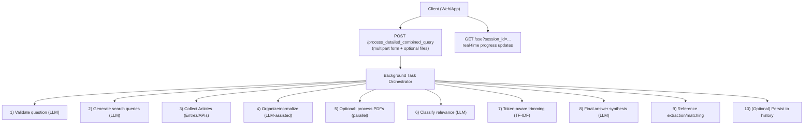
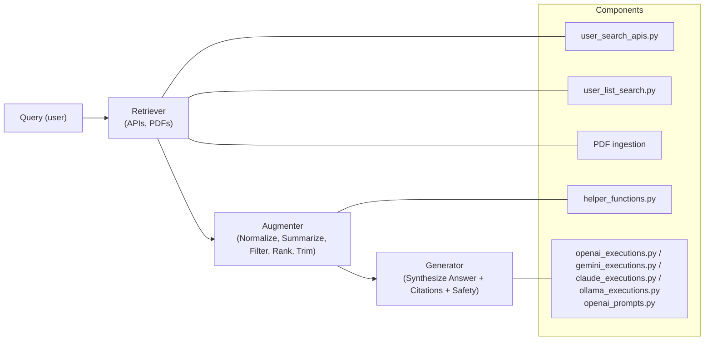
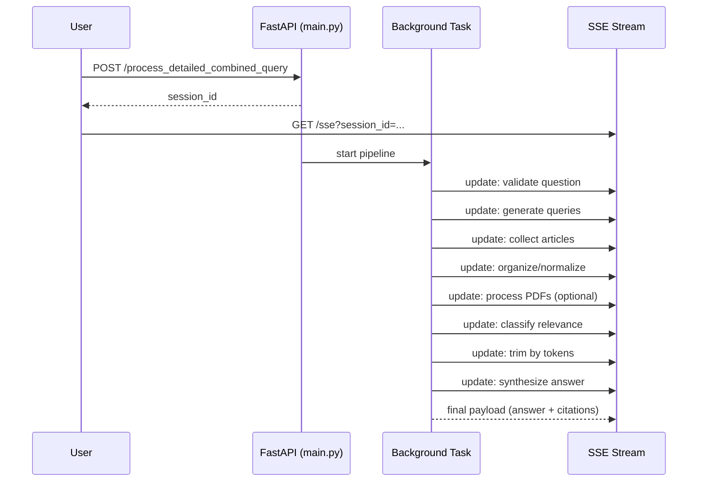
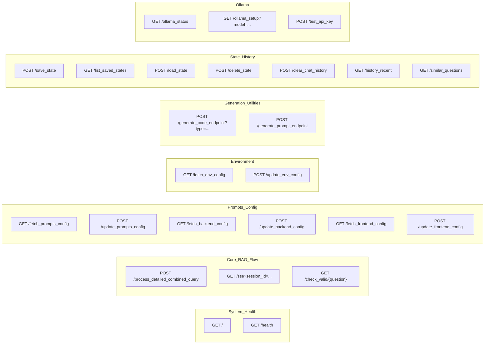

# Backend Documentation

## TL;DR
- This FastAPI backend orchestrates a research QA pipeline: validate question → generate Article queries → collect articles → normalize/organize → optional full-text and PDF processing → relevance classification → evidence-trim → final answer synthesis → citations → (optional) chat history persist.
- Pluggable LLM execution (OpenAI, Gemini, Claude, or **Ollama**) is selected via `LLM` in `variables.env`. All intelligent extraction, summarization, and classification steps route through `helper_functions.py`, which calls into `openai_executions.py`, `gemini_executions.py`, `claude_executions.py`, or `ollama_executions.py`.
- The main user-facing APIs live in `main.py`, which coordinates the entire flow and streams progress updates via Server-Sent Events (SSE).
- **Ollama (local LLM)**: When `LLM=Ollama` the system connects to a locally running Ollama server via its OpenAI-compatible REST API (`http://localhost:11434/v1/`). The `/ollama_setup` SSE endpoint automates installation, server startup, and model download with per-platform multi-method fallback logic.


## Overview
This backend is a Retrieval-Augmented Generation (RAG) system tailored for evidence-grounded answers from biomedical literature. It explains how the system works end‑to‑end, where each file fits in the lifecycle, and how functions participate in the request flow—without low-level implementation details.

What this is (RAG in one sentence): Retrieve relevant documents (Articles, PDFs) → Augment context with normalization, summaries, and safety checks → Generate a final, referenced answer with an LLM.


## Architecture at a glance



## RAG architecture (conceptual)



## End-to-end sequence (expanded)



## Core execution model
- LLM backend selection: `helper_functions.get_llm_client()` checks `LLM` in `variables.env` and routes calls to OpenAI (`openai_executions.py`), Gemini (`gemini_executions.py`), Claude (`claude_executions.py`), or Ollama (`ollama_executions.py`).
- Prompting: Reusable prompt texts come from `openai_prompts.py` (OpenAI) and `generic_prompts.py` (Gemini-facing utility prompts). `main.py` can also fetch/update these at runtime.
- Robustness: The LLM call layers contain retry wrappers to keep the pipeline resilient to transient errors. `ollama_executions.py` adds an additional `_safe_create()` wrapper that converts `NotFoundError` (model not pulled) and `APIConnectionError` (server not running) into descriptive `ValueError` messages rather than raw 500 errors.
- Streaming UX: Progress updates are pushed over SSE via a per-session queue so the UI can show stepwise progress.


## Execution lifecycle (step-by-step)
1) Ingress and session setup (main.py)
- Client submits `user_query` and flags for database search, ID search, and/or PDF uploads to `POST /process_detailed_combined_query`.
- The server allocates a `session_id`, initializes a queue for SSE, and spawns a background task `process_detailed_combined_logic(...)` while the client listens on `GET /sse?session_id=...`.

2) Question validity gate (helper_functions.determine_question_validity)
- Uses an LLM to classify if the user question should be answered (e.g., screens out recipe/animal questions). This feeds `GET /check_valid/{question}` and is also available to other flows as needed.

3) Query generation (helper_functions.query_generation)
- The LLM generates a general query and, if enabled, additional “contention” queries. The feature flag `QUERY_CONTENTION_ENABLED` resides in `openai_prompts.py`.
- Optionally, queries can be refined based on frontend configuration or a local cleaner function (see `clean_query.py` note below and the refinement hook in `main.py`).

4) Article collection (user_search_apis.collect_articles)
- Search via API : retrieves and deduplicates relevant articles per generated query, enforcing sensible limits and retry/backoff.
- If users provide specific IDs (PMIDs), `user_list_search.fetch_articles_by_pmids` augments the article pool.

5) Organization and normalization (helper_functions.concurrent_organize_database_articles → organize_database_articles)
- Each article is normalized into a canonical schema (title, authors, abstract, doi, url, date, journal, etc.).
- Publication type is classified (study vs review). Abstract/title/author fallbacks are filled if missing, and a short query-tailored summary is generated per article — all via the selected LLM.

6) Optional URL-based re-summarization (helper_functions.process_articles_by_url)
- If an article includes a URL, the backend can fetch and clean text content, then generate a fresh summary to improve the downstream answer quality.

7) Optional PDF ingestion (main.process_pdf_articles_parallel → helper_functions.process_pdf_article)
- Uploaded files (PDF/DOCX) are processed in parallel. Text is extracted, cleaned, typed (study/review), and summarized using the same prompt suite.

8) Relevance filtering (helper_functions.concurrent_relevance_classification → relevance_classifier)
- Each organized article is judged relevant or not via an LLM prompt focused on usefulness to the question and safety criteria (e.g., excludes animal‑only studies).

9) Token-aware trimming (helper_functions.trim_relevant_articles_by_token_limit)
- Selected relevant articles are ranked by query similarity (TF‑IDF cosine) and pruned to respect a maximum token budget for the final synthesis step.

10) Final answer synthesis (helper_functions.generate_final_response)
- The LLM synthesizes a research-backed answer from the trimmed set using the final response prompt, then appends a standardized disclaimer.

11) Reference extraction and mapping (helper_functions.print_referenced_articles)
- Parses the references section from the synthesized answer and matches them back to the best corresponding article metadata (DOI-first, then title heuristics). Falls back gracefully if nothing matches.

12) (Optional) History persistence (main.process_detailed_combined_logic)
- If the frontend config enables chat history, the backend appends the Q&A result to `historical_answer.json` for subsequent recall and similarity searches.


## Component roles in the RAG pipeline
- Retriever
  - `user_search_apis.collect_articles`: Article retrieval from generated queries.
  - `user_list_search.fetch_articles_by_ids`: ID-specific enrichment.
  - `main.process_pdf_articles_parallel` → `helper_functions.process_pdf_article`: local document ingestion.

- Augmenter
  - `helper_functions.organize_database_articles` (+ concurrent wrapper): canonicalize records; enrich metadata; classify type; generate summaries.
  - `helper_functions.concurrent_relevance_classification`: LLM relevance decision with safety biasing.
  - `helper_functions.trim_relevant_articles_by_token_limit`: ranking and pruning for budget.
  - `helper_functions.print_referenced_articles`: map synthesized references back to sources.

- Generator
  - `helper_functions.generate_final_response` → OpenAI/Gemini adapters using `openai_prompts.FINAL_RESPONSE_PROMPT` and `DISCLAIMER_TEXT`.


## File-by-file roles in the flow
- main.py (entrypoint & API surface)
  - Owns FastAPI app, CORS, background task orchestration, SSE streaming queues.
  - Implements all endpoints for processing, configuration, persistence, and utilities (listed below).

- helper_functions.py (pipeline coordinator and utilities)
  - LLM client selection and all high-level orchestration helpers (question validity, query generation, organization, relevance classification, trimming, final synthesis, reference mapping, PDF processing helpers, string cleaners, TF‑IDF utilities, etc.).
  - Calls into `openai_executions.py`, `gemini_executions.py`, or `claude_executions.py` for the actual LLM calls.

- openai_executions.py (OpenAI adapter)
  - Initializes OpenAI client from env.
  - Provides retryable call wrapper and task-specific functions (question validity, query gen, article type, PDF content generation, relevant sections, final response, code/prompt generation).

- gemini_executions.py (Gemini adapter)
  - Initializes Gemini client from env.

- claude_executions.py (Claude adapter)
  - Initializes Anthropic client from env; same entrypoints as OpenAI/Gemini (validity, query gen, article type, PDF/section/final response, code/prompt generation).
  - Provides analogous functions to OpenAI adapter, with Gemini model routing.

- ollama_executions.py (Ollama local-LLM adapter)
  - Connects to the locally running Ollama server via its OpenAI-compatible API endpoint (`http://localhost:11434/v1/`).
  - Reads the active model from `OLLAMA_MODEL` in `variables.env` (default: `llama3.2`).
  - Exposes the same function signatures as the other adapters (question validity, query gen, article type, PDF/section/final response, code/prompt generation) so the pipeline is fully provider-agnostic.
  - Includes a `_safe_create(**kwargs)` wrapper that catches:
    - `openai.NotFoundError` → raises `ValueError("Ollama model '…' was not found — pull it first with 'ollama pull <model>'")`.
    - `openai.APIConnectionError` → raises `ValueError("Cannot connect to Ollama server — ensure 'ollama serve' is running")`.
  - Exposes `reinitialize_ollama_client()` so that saving a new model in the config UI takes effect immediately without a server restart.

- openai_prompts.py (OpenAI prompt constants)
  - Source of truth for OpenAI prompt templates: question validity, query generation, relevance classifier, article type, abstract/summary prompts, relevant sections, final response format, and the `DISCLAIMER_TEXT`.
  - Houses the `QUERY_CONTENTION_ENABLED` feature flag.

- generic_prompts.py (LLM prompt utilities)
  - Additional reusable prompt templates primarily used by code/prompt generation utilities.

- user_search_apis.py (database search)
  - Collects articles for generated queries via APIs, handles de-duplication.

- user_list_search.py (ID-specific augmentation)
  - Fetches articles by a user-provided list of IDs.

- clean_query.py (query refinement)
  - Provides a utility to flatten/normalize messy input lists of queries into a clean unique list of strings. When enabled by frontend config, `main.py` hooks this into the search flow to refine generated queries.

- historical_answer.json (persistence)
  - A JSON log of historical queries and responses. Only used when chat history is enabled on the frontend side.

- variables.env (configuration)
  - Houses API keys and controls the LLM selection via `LLM`.

- requirements.txt (dependencies)
  - Python dependencies needed to run the backend.


## API surface (main.py)
### Endpoint reference (concise)


### Ollama-specific endpoints

**`GET /ollama_status`**
Returns a JSON object describing the current local Ollama environment:
```json
{
  "is_installed": true,
  "is_running": true,
  "installed_models": ["llama3.2", "phi3:mini"]
}
```
Used by the config UI to show pre-check badges before the user starts the setup flow and to populate the "Installed Models" section in the Model Guide.

**`GET /ollama_setup?model=<model_name>`**
Streams Ollama setup progress as Server-Sent Events (4 steps):
1. **Check / install** — detects whether Ollama is present; if not, attempts installation using per-platform multi-method fallback (see below).
2. **Start server** — starts `ollama serve` in the background if not already running; polls for up to 15 seconds.
3. **Pull model** — runs `ollama pull <model>` and streams pull progress lines.
4. **Verify** — confirms the model appears in `GET /api/tags`; emits `complete` event.

Each SSE event carries: `{ type, step, total, message }` where `type` is one of `progress`, `success`, `warning`, `error`, `fatal`, `install_log`, `pull_log`, `complete`.

**Installation fallback strategy per platform:**

| Platform | Method 1 | Method 2 | Method 3 |
|----------|----------|----------|----------|
| macOS | `curl -fsSL https://ollama.com/install.sh \| sh` | `brew install ollama` (if Homebrew present) | Direct binary from GitHub Releases → `/usr/local/bin` |
| Linux | `curl -fsSL https://ollama.com/install.sh \| sh` + `systemctl enable/start` | Arch-aware binary (`amd64`/`arm64`) → `~/.local/bin` | — |
| Windows | PowerShell: `irm https://ollama.com/install.ps1 \| iex` | `winget install Ollama.Ollama` (if winget present) | — |

Each method is tried in sequence; setup stops at the first success. A `fatal` SSE message is emitted if all methods fail, with platform-specific manual instructions.

**`POST /test_api_key`**
Accepts `{ provider, api_key }` (or no `api_key` for Ollama connection test) and returns `{ ok: bool, message: str }`. Supports providers: `openai`, `gemini`, `anthropic`, `ollama`.


## Environment & setup
1) Python and dependencies
- Use Python 3.9+ and install dependencies:
```bash
python -m venv venv
source venv/bin/activate
pip install -r requirements.txt
```

2) Environment configuration
- Create or edit `variables.env` next to `main.py`. At minimum set:
  - `OPENAI_API_KEY` (required if `LLM=OpenAI`)
  - `GEMINI_API_KEY` (required if `LLM=Gemini`)
  - `ANTHROPIC_API_KEY` (required if `LLM=Claude`)
  - `LLM` = `OpenAI`, `Gemini`, `Claude`, or `Ollama`
  - `OLLAMA_MODEL` (required if `LLM=Ollama`, e.g. `llama3.2`, `phi3:mini`, `llama3.1:8b`, `qwen3:8b`, `codellama:7b`)
  - `OLLAMA_BASE_URL` (optional; defaults to `http://localhost:11434/v1/`)
- Other provider keys are optional but supported (Elsevier, Springer, Wiley, etc.).
- When `LLM=Ollama`, no cloud API key is needed. Use the Configuration UI → Environment → Ollama section to select a model and trigger the automated setup flow.

3) Run the server
```bash
uvicorn main:app --host 0.0.0.0 --port 8000 --reload
```
Open the interactive docs at `/docs`.


## Configuration matrix

```mermaid
classDiagram
  class LLM_Provider {
    source: variables.env
    key: LLM
    purpose: Select OpenAI, Gemini, Claude, or Ollama
  }
  class OpenAI_Config {
    source: variables.env
    key: OPENAI_API_KEY
    purpose: Auth for OpenAI calls
  }
  class Gemini_Config {
    source: variables.env
    key: GEMINI_API_KEY
    purpose: Auth for Gemini calls
  }
  class Claude_Config {
    source: variables.env
    key: ANTHROPIC_API_KEY
    purpose: Auth for Claude calls
  }
  class Ollama_Config {
    source: variables.env
    keys: OLLAMA_MODEL, OLLAMA_BASE_URL
    purpose: Local model name and server URL (no cloud key needed)
  }
  class Entrez_Email {
    source: variables.env
    key: ENTREZ_EMAIL
    purpose: Required for Entrez API
  }
  class Other_Providers {
    source: variables.env
    keys: ELSEVIER_API_KEY, SPRINGER_API_KEY, WILEY_API_KEY
    purpose: Optional provider integrations
  }
  class Prompts_Config {
    source: openai_prompts.py
    keys: multiple constants
    purpose: System/user prompts per subtask
  }
  class Feature_Flags {
    source: openai_prompts.py
    key: QUERY_CONTENTION_ENABLED
    purpose: Toggle contention query generation
  }
  class Frontend_Flags {
    source: customnerd-website/user_env.js
    flags: query_cleaning, chat_history, logo
    purpose: Frontend toggles consumed by backend
  }
```



Query lifecycle (developer view)
- Inbound request registers a `session_id` and kicks off a background pipeline.
- The pipeline emits progress messages (e.g., generating queries, collecting articles, classifying relevance) to the SSE stream.
- LLM usage is abstracted behind helper functions; prompts come from configuration modules and can be hot-swapped via endpoints.
- Final output includes:
  - A research-backed narrative answer with a fixed disclaimer.
  - A `citations_obj` array of structured references mapped back to available metadata.
  - Optional persistence into `historical_answer.json` if enabled by frontend config.


## Operational concerns & notes
- Token budgeting: Before the final synthesis, content is pruned to respect a maximum token limit. This protects the LLM call from overflow and preserves the most relevant evidence.
- Resiliency: LLM and network calls use retries with exponential backoff where appropriate.
- Extensibility: Add new data sources by implementing fetch/parse modules and plugging them into the orchestrator before the organization step.
- Safety guardrails: Relevance classification excludes animal-only studies for end-user responses and highlights risk/safety information where applicable.
 - Determinism: When comparing outputs across providers, keep prompts stable and record `LLM`/temperature in logs.
 - Observability: Critical steps emit SSE breadcrumbs; capture server logs for LLM/HTTP errors.


## Key takeaways for developers
- `main.py` exposes the APIs, manages SSE, and orchestrates the pipeline.
- `helper_functions.py` centralizes the pipeline steps and shields the rest of the code from model/provider specifics.
- `openai_executions.py`, `gemini_executions.py`, `claude_executions.py`, and `ollama_executions.py` provide drop-in LLM backends; switch via `LLM` in `variables.env`.
- `ollama_executions.py` uses the OpenAI Python SDK pointed at `http://localhost:11434/v1/` — no separate SDK needed. All Ollama errors are surfaced as human-readable `ValueError` messages via `_safe_create()`.
- The `/ollama_setup` SSE stream handles the full local-LLM lifecycle (install → serve → pull → verify) with multi-method per-platform fallbacks.
- `/ollama_status` is a lightweight pre-check endpoint for the UI to show install/running/model status before triggering setup.
- `/test_api_key` validates cloud API keys (OpenAI, Gemini, Claude) and tests Ollama server reachability in one unified endpoint.
- Prompts live in `openai_prompts.py` and `generic_prompts.py` and can be fetched/updated at runtime.
- Search is Article-first (`user_search_apis.py`), with optional ID augmentation (`user_list_search.py`) and optional PDF ingestion.
- Final answers always include a disclaimer; references are parsed and mapped back to structured metadata.
