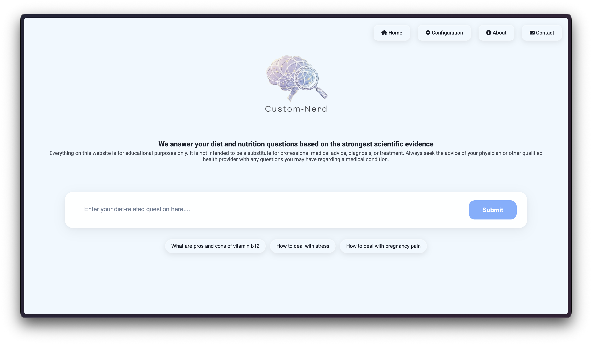
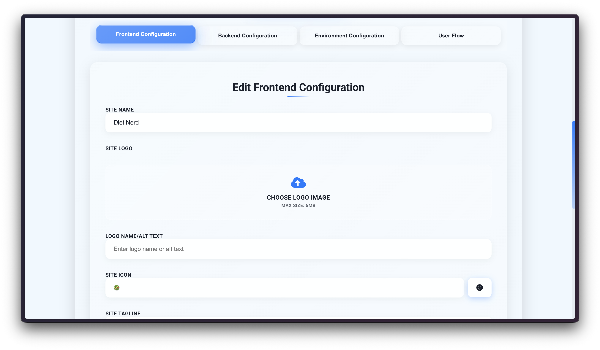
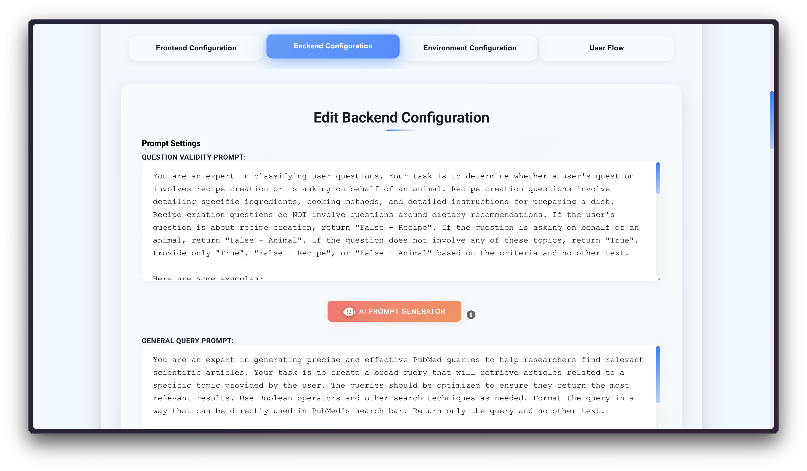
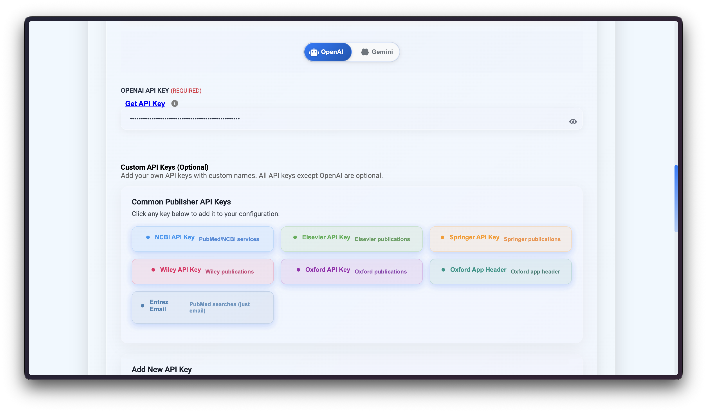
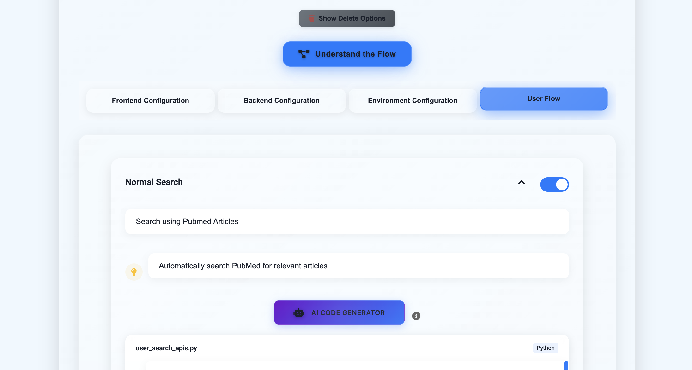
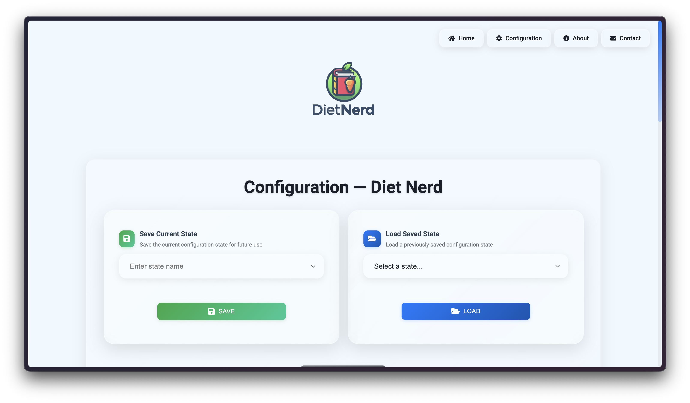

# Custom-Nerd/Nerd-Engine

[](https://opensource.org/licenses/MIT)
[](https://www.python.org/downloads/)
[](https://fastapi.tiangolo.com/)
[](https://openai.com/)




Custom-Nerd/Nerd-Engine is a modular, configuration-driven research assistant engine that connects domain-specific data sources with an LLM-powered processing pipeline to collect, filter, and synthesize evidence-based answers (with citations) in real time. It adapts to new domains via configuration—not code changes—using pluggable search integrations, prompt sets, and environment keys.

## TL;DR

- What: Modular, configuration-driven research assistant engine (FastAPI + JS + OpenAI/Gemini/Claude/Ollama) that searches external sources and synthesizes evidence-backed answers.
- Domains: DietNerd (PubMed), NewsNerd (GNews/NewsAPI/Guardian), SpaceNerd (arXiv/NASA/ADS), SciNer (QASPER dataset-based), CloudNerd (Stack Overflow).
- Run it:
  - **macOS/Linux:** 
  1) `python3 setup.py`
  2) `python3 run.py`
  - **Windows:**
    1) Open PowerShell as Administrator → `python presetup.py` (sets up WSL2/Ubuntu; may fail first time - let it complete, restart, then run again)
    2) `python setup.py` (runs inside WSL2)
    3) `python run.py` (runs inside WSL2)
  - Then: Open the Configuration page → add API keys (or choose Ollama for fully local operation) → save.
- Keys: OPENAI_API_KEY, GEMINI_API_KEY, or ANTHROPIC_API_KEY (Claude)—one required for cloud providers. **Ollama requires no API key**—select it in the Environment tab and use the built-in setup flow to install and run models locally. Optional per domain: GNEWS_API_KEY, NEWS_API_KEY, GUARDIAN_API_KEY, ELSEVIER_API_KEY, SPRINGER_API_KEY, WILEY_API_KEY, OXFORD_API_KEY, OXFORD_APP_HEADER, ADS_API_TOKEN.
- Configure: Frontend, Backend Prompts, Environment, User Flow, Save/Load State.

## Table of Contents
- [Overview](#overview)
- [Features](#features)
- [Technology Stack](#technology-stack)
- [Prerequisites](#prerequisites)
- [Project Structure](#project-structure)
- [Getting Started](#getting-started)
- [Configuration](#configuring-custom-nerd)
- [Development](#development)
- [Contributing](#contributing)
- [Troubleshooting](#troubleshooting)
- [FAQ](#faq)
- [License](#license)
- [Disclaimer](#disclaimer)

## Overview (Detailed)

Custom-Nerd/Nerd-Engine is a modular, configuration-driven research assistant engine. It consists of:
- Backend: FastAPI service implementing a 9-stage processing pipeline (validation → query generation → collection → relevance → processing → synthesis → citations → delivery), SSE updates, and prompt-driven LLM integration.
- Frontend: Lightweight HTML/JS UI with configurable branding, user flow, and state management.
- Configuration Layer: Frontend UI config, user flow strategies, backend prompts, and environment variables. Full save/load state support per domain template.

### Supported Domains
- **DietNerd**: PubMed-based medical/nutrition research (via Bio.Entrez). Comprehensive citations and references with full academic features.
- **NewsNerd**: Multi-source news aggregation (GNews, NewsAPI, The Guardian) with deduplication and recency. Simplified interface for current events.
- **SpaceNerd**: Space/astronomy research using arXiv/ADS with advanced query cleaning capabilities. Full feature set with specialized query processing.
- **SciNer**: Scientific paper QA based on the QASPER dataset (questions, evidence, and annotations-driven).
- **CloudNerd**: Cloud technology research using Stack Overflow discussions. Technical solutions with security focus and best practices.

### Key Capabilities
- Evidence-based answers with citations
- Multi-source collection per domain
- Real-time progress via SSE
- PDF upload (domain-dependent)
- Prompt-managed LLM calls with retry/backoff
- **Query Cleaning**: Advanced query preprocessing and refinement
- **Similarity Search**: Find similar questions from chat history using TF-IDF and multiple similarity algorithms
- **Chat History**: Automatic saving of questions and answers with configurable visibility
- State save/restore (DietNerd/NewsNerd/SpaceNerd/CloudNerd patterns)

### Essential Keys
- Required (choose one cloud provider): OPENAI_API_KEY, GEMINI_API_KEY, or ANTHROPIC_API_KEY (Claude). Set `LLM` in Environment Configuration to the provider you use.
- **Ollama (local, no key needed)**: Select `Ollama` in the Environment tab, pick a model, and click "Setup Ollama" — the system installs Ollama, pulls the model, and starts the server automatically.
- Optional by domain: ELSEVIER_API_KEY, SPRINGER_API_KEY, WILEY_API_KEY, OXFORD_API_KEY, OXFORD_APP_HEADER, GNEWS_API_KEY, NEWS_API_KEY, GUARDIAN_API_KEY, ADS_API_TOKEN

### Docs

Comprehensive documentation for Custom-Nerd/Nerd-Engine is available in the following files:

- [Architecture Summary](Documentation/ARCHITECTURE_SUMMARY.md) - Overview of the system architecture and design patterns
- [Case Studies Documentation](Documentation/CASE_STUDIES_DOCUMENTATION.md) - Detailed case studies and implementation examples
- [Case Studies Quick Reference](Documentation/CASE_STUDIES_QUICK_REFERENCE.md) - Quick reference guide for case studies
- [Case Studies Summary](Documentation/CASE_STUDIES_SUMMARY.md) - Summary of key case studies and findings
- [Detailed Project Documentation](Documentation/DETAILED_PROJECT_DOCUMENTATION.md) - Comprehensive project documentation
- [Installation Case Studies](Documentation/INSTALLATION_CASE_STUDIES.md) - Installation guides and troubleshooting case studies

### Design Specs

- [Backend Documentation](Documentation/Design/Backend_README.md) - Comprehensive backend architecture and implementation details
- [Frontend Documentation](Documentation/Design/Frontend_README.md) - Frontend architecture, user flow, and configuration management


GitHub links to the five guides:
- [DietNerd (GitHub)](https://github.com/Harsh23Kashyap/customnerd/tree/main/Documentation/nerd%20models/DietNerd.md)
- [NewsNerd (GitHub)](https://github.com/Harsh23Kashyap/customnerd/tree/main/Documentation/nerd%20models/NewsNerd.md)
- [SpaceNerd (GitHub)](https://github.com/Harsh23Kashyap/customnerd/tree/main/Documentation/nerd%20models/SpaceNerd.md)
- [SciNer (QASPER-based) (GitHub)](https://github.com/Harsh23Kashyap/customnerd/tree/main/Documentation/nerd%20models/SciNer.md)
- [CloudNerd (GitHub)](https://github.com/Harsh23Kashyap/customnerd/tree/main/Documentation/nerd%20models/CloudNerd.md)

### Saved State Templates

Preconfigured domain templates live in `customnerd-backend/saved_states/` and can be loaded from the Configuration UI (Load/Save State) or applied manually by copying files into the backend/website locations.

- DietNerd: PubMed-focused medical/nutrition research
- NewsNerd: Multi-source news aggregation (GNews, NewsAPI, Guardian)
- Space Nerd: Space/astronomy with arXiv, NASA Images, optional NASA ADS; includes `clean_query.py`
- SciNer: QASPER-based scientific paper QA workflow
- CloudNerd: Stack Overflow-based cloud technology research

Each template contains:
- `openai_prompts.py`: prompt set for the backend pipeline
- `user_env.js`: frontend branding and UI configuration
- `user_search_apis.py`, `user_list_search.py`: search implementations
- `variables.env`: environment vars needed by that domain
- `historical_answer.json`: chat history storage (empty by default, populated during usage)
- Optional domain files like `clean_query.py`

Load a template:
1) Open Configuration → Load and Save State → select a saved state → Load
2) Or copy the template files from `saved_states/<TemplateName>/` into the running environment and restart the server

Security note: never commit real API keys. Replace any placeholders in `variables.env` with your own keys locally and keep them out of version control.

### Similarity Search and Chat History Features

**Similarity Search**: The system includes an advanced similarity search feature that finds similar questions from chat history using multiple algorithms:
- TF-IDF vectorization with cosine similarity
- Word-level and character-level similarity scoring
- Jaccard similarity for token overlap
- Fuzzy string matching using difflib
- Configurable similarity threshold (default: 0.3) and result limit (default: 3)

**Chat History Management**: 
- Automatic saving of questions and answers to `historical_answer.json`
- Configurable visibility through frontend settings (`chat_history.visible`)
- Session-based tracking with unique session IDs
- Recent history retrieval with configurable limits
- Clear chat history functionality
- Integration with saved state templates

Custom-Nerd/Nerd-Engine is a web-based LLM-powered tool that answers domain-specific questions by extracting and summarizing information from multiple sources. Current implementations include:
- **DietNerd**: PubMed-centric medical/nutrition research with full academic features
- **NewsNerd**: Multi-source news aggregation (GNews, NewsAPI, The Guardian) with simplified interface
- **SpaceNerd**: Astronomy research via arXiv/ADS with advanced query cleaning capabilities

The tool is designed to provide reliable and up-to-date information for individuals, professionals, and researchers alike. Our mission is to enrich domain knowledge and equip users with evidence-based information from academic literature.

## Features

- Query-based domain-specific information
- Evidence-based answers backed by scientific research
- Similar question suggestions
- PDF generation of answers
- Reference analysis with links to full articles
- Multi-database academic paper sourcing

## Technology Stack

- Frontend: HTML, CSS, JavaScript
- Backend: FastAPI, Python
- Databases: MySQL
- LLM Integration: OpenAI GPT, Google Gemini, Anthropic Claude, or **Ollama (local)** — configurable via the Environment tab in the Configuration UI. Ollama uses the OpenAI-compatible REST API (`http://localhost:11434/v1/`) so no separate SDK is required.

## Project Structure

- `customnerd-website/`: Frontend application files
  - `index.html`: Main page of the application
  - `index.js`: Core functionality for querying and displaying answers
  - `index.css`: Styles for the main page
  - `reference.html`: Page for displaying detailed reference information
  - `reference.js`: Functionality for the reference page
  - `reference.css`: Styles for the reference page
  - `about.html`: Information about Custom-Nerd/Nerd-Engine and the team
  - `about.css`: Styles for the about page
  - `contact.html`: Contact form for user feedback
  - `contact.css`: Styles for the contact page
  - `env.js`: Environment variables for API endpoints
  - `user_env.js`: User-specific environment variables (site name, logo, icons)
  - `user_based.js`: User-specific based on user input

- `customnerd-backend/`: Backend application files
  - `main.py`: Main FastAPI application file
  - `helper_functions.py`: Helper functions for the backend
  - `openai_prompts.py`: OpenAI prompts for the backend for user to configure
  - API endpoints
  - Database connections
  - LLM integration
  - Academic database interfaces

# 🚀 Custom-Nerd/Nerd-Engine – Backend Setup

## Quick Installation

> **💡 Tip:** If you encounter errors during installation, try using ChatGPT or Gemini - they are really helpful for debugging installation issues!

### Prerequisites
- Python 3.11 or 3.12 ([Download Python 3.11.9](https://www.python.org/downloads/release/python-3119/))
  - **macOS:** Download macOS 64-bit universal2 installer
  - **Windows:** Download Python install manager
  - **Linux:** Download XZ compressed source tarball or use your distribution's package manager
- Internet connection
- **Windows:** During Python installation, a terminal window will appear. Type `y` and press Enter when prompted to:
  - Add Python to PATH
  - Install Cython

### Installation Steps

#### **Windows:**

1. **Open PowerShell as Administrator:**
   - Press `Windows Key + X` → Select "Windows PowerShell (Admin)"
   - Or press `Windows Key` → Type "PowerShell" → Right-click → "Run as Administrator"

2. **Navigate to project:**
   ```powershell
   cd Downloads\customnerd-main\customnerd-main
   ```

3. **Install WSL2 and Ubuntu:**
   ```powershell
   python3 presetup.py
   ```
   **⚠️ Important:** `presetup.py` might fail the first time - this is normal! Let the installation run completely, then restart your system. After restarting, run `python3 presetup.py` again. This installs WSL2 and Ubuntu.

4. **Open new terminal → Enter WSL:**
   ```powershell
   wsl -d Ubuntu
   ```

5. **Navigate to project (inside WSL):**
   ```bash
   cd Downloads/customnerd-main/customnerd-main
   ```

6. **Run setup:**
   ```bash
   python3 setup.py
   ```
   
   **⏰ Important:** `setup.py` will take a couple of hours to complete. Please wait patiently - this is normal!

7. **Start server:**
   ```bash
   python3 run.py
   ```

#### **macOS/Linux:**

1. **Open Terminal:**
   - **macOS:** `Cmd + Space` → Type "Terminal" → Enter
   - **Linux:** `Ctrl + Alt + T`

2. **Navigate to project:**
```bash
   cd ~/Downloads/customnerd-main/customnerd-main
   ```

3. **Run setup:**
   ```bash
   python3 setup.py
   ```
   **⏰ Important:** `setup.py` will take a couple of hours to complete. Please wait patiently - this is normal!

4. **Start server:**
   ```bash
   python3 run.py
   ```

### Important Notes

- **If `setup.py` fails:** Don't worry if it fails on the first run - this is common! Check what failed in the error messages, fix any issues (if needed), and run the script again. The script will resume from where it left off and fix most issues automatically.
- **Logs:** All logs are saved in `logs/` folder:
  - `logs/presetup/` - Windows WSL setup logs
  - `logs/setup/` - Installation logs
  - `logs/run/` - Server run logs
- **Troubleshooting:** If you encounter errors, check the logs and try using ChatGPT or Gemini for help.

### Configure API Keys

After installation, open `customnerd-backend/variables.env` and add your `OPENAI_API_KEY` (required).

## Step 8: Update Environment Keys (REQUIRED)

⚠️ IMPORTANT: Your setup will not work until you complete this step!


## Step 9: If Setup Doesn't Work Initially

If you encounter issues after initial setup:

1. Double-check that all API keys are entered correctly in the Configuration panel
2. Ensure the backend server is running (you should see "Application startup complete")
3. Try stopping and restarting the backend server:
   ```sh
   # Press Ctrl+C (or Command+C on Mac) to stop the server
   python run.py  # Restart the server
   ```
4. Clear your browser cache and refresh the page
5. If issues persist, check the terminal for specific error messages and troubleshoot accordingly


Once the frontend is open:

1. Click on the **Configuration** button in the top-right corner.
2. Update your API keys in the **Environment Configuration** section.
3. Follow the steps provided on that page to enter your keys correctly.

The system cannot function without valid API keys - this step is mandatory before you can use any features.

## Troubleshooting Tip

There will be moments when you might get stuck due to errors. If that happens, copy the exact terminal error message and paste it into **ChatGPT or Gemini**. These AI tools can help you quickly troubleshoot and resolve issues.


## Configuring Custom-Nerd/Nerd-Engine

### Frontend Configuration


This tab allows you to configure frontend parameters such as:
- **Site Name**: Change the name of your application
- **Site Icon**: Set a custom emoji icon (e.g., "🥗")
- **Site Tagline**: Modify the tagline that appears on the homepage
- **Disclaimer**: Edit the disclaimer text shown to users
- **Question Placeholder**: Change the placeholder text in the search box
- **Styling**:
  - Background color (e.g., "#faf7e8")
  - Font family (e.g., "'Roboto', sans-serif")
  - Submit button color (e.g., "#007bff")

### Backend Configuration


This tab allows you to configure backend parameters such as:
- **DETERMINE_QUESTION_VALIDITY_PROMPT**: Configure prompt for validating questions
- **GENERAL_QUERY_PROMPT**: Set prompt for general query processing
- **QUERY_CONTENTION_PROMPT**: Customize handling of contentious queries
- **RELEVANCE_CLASSIFIER_PROMPT**: Adjust relevance classification parameters
- **ARTICLE_TYPE_PROMPT**: Modify article type classification prompt
- **ABSTRACT_EXTRACTION_PROMPT**: Configure abstract extraction process
- **REVIEW_SUMMARY_PROMPT**: Set prompt for summarizing review articles
- **STUDY_SUMMARY_PROMPT**: Customize study summary generation
- **RELEVANT_SECTIONS_PROMPT**: Adjust prompt for identifying relevant sections
- **FINAL_RESPONSE_PROMPT**: Configure final response generation template
- **DISCLAIMER_TEXT**: Edit the disclaimer text for responses
- **disclaimer**: Modify the general disclaimer message
> **Tip:** You can use the built-in AI Prompt Editor to modify any backend or frontend prompt for compatibility with your preferred LLM or workflow. Simply click the "Edit" button next to a prompt, make your changes, and save. This allows you to quickly adapt prompts for different models or use cases without editing code directly.

### Environment Configuration


This tab allows you to update all your API keys and environment variables:
- **NCBI_API_KEY**: Update your NCBI API key here. [Get API Key](https://support.nlm.nih.gov/kbArticle/?pn=KA-05317)
- **AI Provider**: Choose OpenAI, Gemini, Claude, or **Ollama** via the 4-segment pill. Only the selected provider’s key is required (Ollama needs no key).
- **OPENAI_API_KEY**: Update your OpenAI API key here. [Get API Key](https://openai.com/index/openai-api/) — “Test” button validates the key inline.
- **GEMINI_API_KEY**: Update your Google Gemini API key here. [Get API Key](https://ai.google.dev/) — “Test” button validates the key inline.
- **ANTHROPIC_API_KEY**: Update your Anthropic (Claude) API key here. [Get API Key](https://console.anthropic.com/settings/keys) — “Test” button validates the key inline.
- **Ollama (local)**: No API key needed. Select a model from the dropdown (`llama3.2`, `phi3:mini`, `llama3.1:8b`, `qwen3:8b`, `codellama:7b`, `kimi-k2.5:cloud`, or custom). Click “Model Guide” (❓) to see a filterable table with RAM/disk requirements, speed, quality, and a Basic/Advanced view toggle. Click “Setup Ollama” to automatically install Ollama, pull the chosen model, and start the server. Click “Test Connection” to verify the local server is reachable.
- **ELSEVIER_API_KEY**: Update your Elsevier API key here. [Get API Key](https://dev.elsevier.com/apikey/manage)
- **SPRINGER_API_KEY**: Update your Springer API key here. [Get API Key](https://dev.springernature.com/docs/quick-start/api-access/)
- **WILEY_API_KEY**: Update your Wiley API key here. [Get API Key](https://onlinelibrary.wiley.com/library-info/resources/text-and-datamining)
- **ENTREZ_EMAIL**: Update your Entrez email here.
- **OXFORD_API_KEY**: Update your Oxford API key here.
- **OXFORD_APP_HEADER**: Update your Oxford app header here.
 - **GNEWS_API_KEY**: Update your GNews API key here.
 - **NEWS_API_KEY**: Update your NewsAPI key here.
 - **GUARDIAN_API_KEY**: Update your Guardian Open Platform key here.
 - **ADS_API_TOKEN**: Update your NASA ADS token here (if SpaceNerd enabled).
In addition to the predefined fields, you can also add custom API keys and values as needed. Use the "Add API Key" option to input a new key-value pair, which will be appended to your environment variable list. This feature allows you to integrate additional services or credentials without modifying the codebase.

After making changes, click "Save" to apply your configurations or "Reset to Default" to revert to original settings.

### User Flow Configuration


The User Flow section provides a comprehensive interface for customizing how search functionality is presented and implemented in your Nerd Expert system. This section includes:

#### 1. Normal Search Configuration
- **Toggle Switch**: Enable/disable editing of the search implementation
- **Search Input**: Customize the search interface text
- **Hint Text**: Add helpful hints for users
- **AI Code Generator**: Automatically generate compatible code for your search implementation
- **Code Editor**: View and edit the Python implementation for normal search functionality
  - File: `user_search_apis.py`
  - Language: Python
  - Note: Ensure API names match those in environment configuration

#### 2. ID Specific Search Configuration
- **Toggle Switch**: Enable/disable editing of ID-based search
- **Search Input**: Customize the ID search interface text
- **Hint Text**: Add helpful hints for ID-based searches
- **Code Editor**: View and edit the Python implementation for ID-specific search
  - File: `user_list_search.py`
  - Language: Python
  - Note: Ensure API names match those in environment configuration

#### 3. Local Document Search Configuration
- **Toggle Switch**: Enable/disable local document search functionality
- **Search Input**: Customize the local document search interface
- **Hint Text**: Add helpful hints for local document searches

#### 4. Query Cleaning Configuration
- **Toggle Switch**: Enable/disable advanced query preprocessing
- **AI Code Generator**: Automatically generate query cleaning functions
- **Code Editor**: View and edit the Python implementation for query refinement
  - File: `clean_query.py`
  - Language: Python
  - Function: `clean_query(query)` - refines and normalizes search queries
- **Note**: Available in SpaceNerd configuration, can be enabled for other domains

#### 5. Reference Display Configuration
- **Toggle Switch**: Enable/disable reference section visibility
- **Note**: Reference display depends on proper Nerd Engine configuration

#### AI Code Generator Features
The AI Code Generator tool helps you integrate custom APIs into the system:
1. Enter your API or code snippet
2. Click the AI Code Generator button
3. The system will attempt to:
   - Generate compatible code
   - Fix syntax errors
   - Ensure integration with the existing system
   - Add necessary error handling
   - Implement proper API authentication

**Important Notes:**
- The AI Code Generator works in most cases but may require manual adjustments for complex implementations
- For errors, check the backend code to identify where the integration fails
- Always test generated code thoroughly before deployment
- Some APIs may require additional configuration in the backend
- Custom implementations should follow the system's error handling and response format standards

After making changes, use the "Update User Flow" button to apply your configurations. You can also use "Reset All User Flow" to revert to default settings or "Hard Reset Configuration" for a complete system reset.

### Load and Save State Configuration


The Load and Save State section provides functionality to manage and persist your Custom-Nerd/Nerd-Engine configurations:

#### 1. Save Current Configuration
- **Save Button**: Click to save your current configuration state
- **Configuration Name**: Enter a descriptive name for your configuration
- **Description**: Add optional notes about the configuration
- **Auto-save**: Toggle to enable automatic saving of changes

#### 2. Load Saved Configuration
- **Configuration List**: View all saved configurations
- **Search**: Filter configurations by name or description
- **Load Button**: Restore a selected configuration
- **Preview**: View configuration details before loading


#### Best Practices
1. **Regular Backups**
   - Save configurations before major changes
   - Export important configurations
   - Keep backup copies of critical settings

2. **Naming Conventions**
   - Use descriptive names
   - Include date in configuration names
   - Add version numbers for iterations

3. **Configuration Organization**
   - Group related settings
   - Document configuration purposes
   - Maintain a clean configuration list

4. **Security Considerations**
   - Don't store sensitive API keys in configurations
   - Use environment variables for secrets
   - Regularly review saved configurations

After making changes, use the "Save Configuration" button to persist your settings. You can also use "Reset to Default" to revert to original settings or "Clear All" to remove all saved configurations.

#### Hard Reset Functionality
The Hard Reset feature provides a complete system reset capability:

1. **What Hard Reset Does**
   - Removes all saved configurations
   - Resets all API keys to default
   - Clears all custom prompts
   - Restores default UI settings
   - Removes all user-specific customizations
   - Clears cache and temporary files

2. **When to Use Hard Reset**
   - System is in an unstable state
   - Multiple configurations are conflicting
   - After major version updates
   - When troubleshooting persistent issues
   - Before transferring to a new environment
   - When starting fresh with new settings

3. **Hard Reset Process**
   - Click "Hard Reset Configuration" button
   - Confirm the reset action
   - System will perform the following:
     - Backup current state (if enabled)
     - Clear all configurations
     - Reset to factory defaults
     - Restart necessary services
     - Verify system integrity

4. **Post-Reset Steps**
   - Re-enter necessary API keys
   - Reconfigure essential settings
   - Test basic functionality
   - Restore any needed configurations
   - Verify all integrations

⚠️ **Warning**: Hard Reset is irreversible and will remove all custom configurations. Always ensure you have backups of important settings before proceeding.

## Disclaimer

Custom-Nerd/Nerd-Engine is an exploratory tool designed to assist research and learning in specific domains. While we strive to provide accurate information from academic sources, users should verify critical information and consult domain experts for professional advice.

## Prerequisites

Before you begin, ensure you have the following installed:
- Python 3.11 or 3.12 (recommended: [Download Python 3.11.9](https://www.python.org/downloads/release/python-3119/))
  - **macOS:** Download macOS 64-bit universal2 installer
  - **Windows:** Download Python install manager (during installation, type `y` and press Enter when prompted to add Python to PATH and install Cython)
  - **Linux:** Download XZ compressed source tarball or use your distribution's package manager
- pip (Python package manager)
- Git
- A modern web browser (Chrome, Firefox, Safari, or Edge)
- Virtual environment tool (venv or conda)

Required API Keys (one LLM key required):
- OpenAI API Key, Google Gemini API Key, or Anthropic (Claude) API Key — set `LLM` in Configuration to match
- **Or use Ollama (no key required)** — select `Ollama` in the Environment tab and use the built-in setup flow
- NCBI API Key
- Elsevier API Key
- Springer API Key
- Wiley API Key
- Oxford API Key


## Contributing

We welcome contributions! Please follow these steps:

1. Fork the repository
2. Create a feature branch (`git checkout -b feature/AmazingFeature`)
3. Commit your changes (`git commit -m 'Add some AmazingFeature'`)
4. Push to the branch (`git push origin feature/AmazingFeature`)
5. Open a Pull Request

Please ensure your code:
- Follows the existing code style
- Includes appropriate tests
- Updates documentation as needed
- Passes all existing tests

## Troubleshooting

### Common Issues and Solutions

1. **Backend Server Won't Start**
   - Check if port 8000 is available
   - Verify all environment variables are set
   - Check virtual environment is activated
   - Review error logs in terminal

2. **API Connection Issues**
   - Verify API keys are correctly entered
   - Check internet connection
   - Ensure API rate limits aren't exceeded
   - Review API documentation for changes

3. **Frontend Loading Issues**
   - Clear browser cache
   - Check browser console for errors
   - Verify all static files are present
   - Check network requests in browser dev tools

4. **SSE/Live Updates Not Appearing**
   - Ensure the backend shows "Application startup complete"
   - Check browser console/network tab for `/sse` connection errors
   - Verify no ad-blockers/extensions are blocking EventSource
   - Reload the page after restarting the backend

5. **Missing or Invalid API Keys**
   - Open Configuration → Environment Configuration and re-enter keys
   - Ensure `ENTREZ_EMAIL` is set for PubMed (required by NCBI)
   - For NewsNerd, confirm `GNEWS_API_KEY` and/or `NEWS_API_KEY` and `GUARDIAN_API_KEY`
   - Restart the backend after updating keys

6. **Rate Limit / 429 Errors**
   - Reduce query frequency; wait 60–120 seconds and retry
   - Verify your plan/quotas with the provider
   - For NewsNerd, the system de-duplicates and sleeps briefly; avoid rapid repeated queries

7. **CORS or Mixed Content Errors**
   - Use the same scheme (http vs https) for frontend and backend during local dev
   - If using a different host/port, enable appropriate CORS in the backend

8. **Dependency/Build Problems**
   - Re-run `python setup_and_run.py` to recreate the venv
   - Manually install failing packages listed during setup
   - If conflicts persist, upgrade pip: `python -m pip install --upgrade pip`

9. **Virtual Environment Activation Issues**
   - macOS/Linux: `source customnerd-backend/venv/bin/activate`
   - Windows: `customnerd-backend\venv\Scripts\activate`
   - Verify `which python` points inside the venv

10. **Port Already in Use (8000)**
    - macOS/Linux: `lsof -i :8000 | grep LISTEN` then kill the PID
    - Windows: `netstat -ano | findstr :8000` then `taskkill /PID <pid> /F`
    - Restart `python run.py`

11. **News API Provider Errors**
    - GNews: verify `GNEWS_API_KEY` and check daily quota
    - NewsAPI: check plan limits; some endpoints may be restricted
    - Guardian: ensure `GUARDIAN_API_KEY` and watch for 401/429 in logs

12. **PubMed/Entrez Errors**
    - Ensure `ENTREZ_EMAIL` is set and valid
    - Add `NCBI_API_KEY` to increase throughput (3 req/sec)
    - Retry after a short delay to avoid temporary outages

13. **Config Not Applying**
    - Click Save in each configuration tab (Frontend/Backend/Env/User Flow)
    - Use Load/Save State to persist and restore known-good configs
    - Hard Reset only if necessary; re-enter keys afterward

14. **Ollama Not Installing or Model Not Found**
    - Click "Setup Ollama" in the Environment tab and watch the step-by-step SSE progress log for the exact failure point
    - macOS: if the curl script fails, ensure Homebrew is installed (`brew --version`) or allow the binary download to `/usr/local/bin`
    - Linux: the script tries `curl … | sh` then falls back to a direct binary download to `~/.local/bin` — ensure `~/.local/bin` is on your `$PATH`
    - Windows: run PowerShell as Administrator; if `irm … | iex` fails, ensure `winget` is available (update Windows or install App Installer from the Microsoft Store)
    - If Ollama is installed but the model is not found: open a terminal and run `ollama pull <model_name>` manually, then retry
    - If the server is not running: run `ollama serve` in a separate terminal window, then use "Test Connection" in the config UI to confirm

15. **Ollama Model Errors During Query Processing**
    - `model '…' not found` — the selected model hasn't been pulled; use the "Setup Ollama" flow or run `ollama pull <model>` in a terminal
    - `Cannot connect to Ollama server` — run `ollama serve` and ensure nothing is blocking port 11434
    - After fixing, reload the Environment tab and save to reinitialize the client without restarting the backend

## FAQ

### General Questions

**Q: What is the minimum system requirement?**
A: For cloud providers (OpenAI/Gemini/Claude): any modern computer with 4 GB RAM and a stable internet connection. For Ollama (local models): 8 GB RAM minimum (16 GB recommended for 7B+ parameter models); M-series MacBooks or modern Intel/AMD CPUs work well for models up to 8B parameters.

**Q: Can I use Custom-Nerd/Nerd-Engine offline?**
A: Partially. With Ollama, LLM inference runs fully locally with no internet needed. However, querying academic databases (PubMed, Springer, etc.) still requires an internet connection. For a fully offline setup you would need to pre-load data or use local document (PDF) search only.

**Q: How often is the academic database updated?**
A: The system uses real-time API connections to academic databases, ensuring the latest information.

### Technical Questions

**Q: Can I use a different LLM instead of GPT?**
A: Yes. The system supports OpenAI, Google Gemini, Anthropic Claude, and **Ollama** (local models). Switch providers from the Environment tab — a 4-segment pill lets you select the provider, and each cloud provider has an inline "Test" button to verify the key. For Ollama, no API key is needed; use the built-in "Setup Ollama" flow to install and run models locally.

**Q: Can I run Custom-Nerd/Nerd-Engine without any cloud API subscription?**
A: Yes. Select **Ollama** as the LLM provider in the Environment tab. The system will automatically install Ollama on your machine, download the chosen model, and start the local server — no external API calls are made during inference. You still need an internet connection for the initial model download and for querying academic databases.

**Q: How do I add support for new academic databases?**
A: You can add new database support through the User Flow Configuration panel.

**Q: Is there a rate limit for queries?**
A: Rate limits depend on your API keys and the specific academic database policies.

## License

This project is licensed under the MIT License - see the [LICENSE](LICENSE) file for details.
